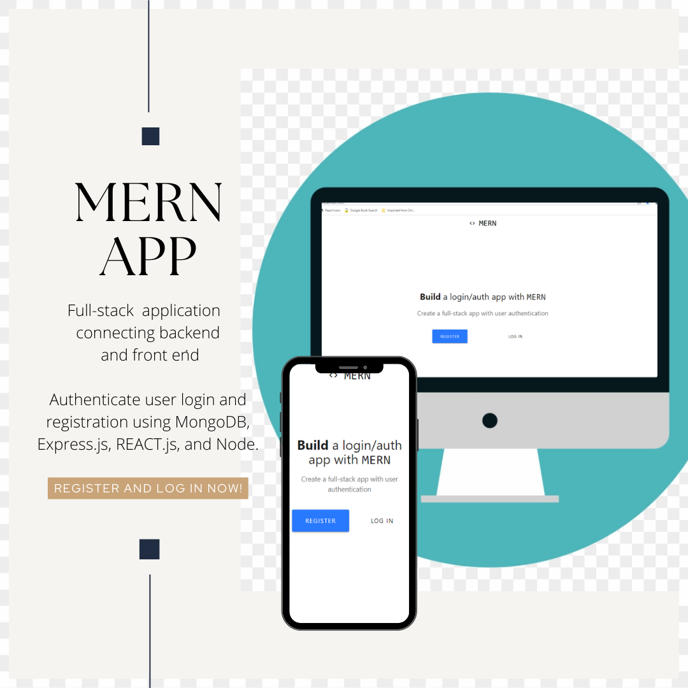

# XCentium Login Challenge
### MERN stack login page repository

## Purpose:heavy_exclamation_mark:

To create a successful login and logout page using a username and password. The user must be able to access the homepage upon successful login and see their name displayed. Upon logout, the user is taken back to the main login page. Unsuccessful login/wrong credentials will display an error message. The homepage should only be seen once the user is successfully logged in.<br>
 <br>

## Table of Contents::mag:

1.  [ LIVE DEPLOY:octocat: ](#github)
2.  [ Installation:hammer: ](#installation)
3.  [ Contributing:handshake: ](#contributing)

## Github

[Click Here](https://verokoles.github.io/mern-login/) to view the application live! <br>

Successful LogIn takes user to homepage:
 <br>
Unsuccecssful Log In:


## Installation

To install dependancies, run the following commands:

     ```
     `npm i` to install node_modules in client, server and root, `npm init` to initialize the project.

     `npm i bcryptjs body-parser concurrently express is-empty jsonwebtoken mongoose passport passport-jwt validator`: this will install all the packages for validating and parsing user data. Then `nodemon` installed to run on dev server and make changes to code.
     ```
     Then change scripts to:
      `"scripts": {
      "start": "concurrently \"cd server && npm run start\" \"cd client && npm start\"",
      "server": "nodemon server.js",
      "install": "cd server && npm i && cd ../client && npm i",
      "build": "cd client && npm run build"
      }` in the root and adjust the client and server scripts
     ```  
     `npm i express validator` <br>

### I. Initialize App on Backend
     - install all packages and set up the backend, <br>
     - connect MongoDB database with user and set the URI in server/config/keys <br>
     - set up API routes with Postman to verify routes

### II. Frontend & Redux Setup
     - create react-app in client directory
     - create components from the landing page, the login/register pages, and the homepage
     - `npm i axios classnames jwt-decode react-redux react-router-dom redux redux-thunk`
     - set up REDUX for global managing, then link store to REACT components
     - set up in SRC: actions, components, and reducers directories
     - react-router-dom in App.js to define routing paths
  
### III. Linking Redux with React Components
     - use connect() from react-redux to connect components
     - display errors from backend in REACT forms
     - create protected routes for registered users 
     - wrap components at the bottom of files in `export withRotuer()`.
     - import propTypes with proptypes package, link REDUX to components and display erros in from
     - create Homepage.js for when users are logged on
     - create protected routes: [Documentation](https://ui.dev/react-router-protected-routes-authentication)
     - tie it all together by checking localStorage for token with JWT if user logged on or if they refresh the app. Define Hompeage as private route.
     - last step: componentDidMount() { .. If logged in and user navigates to Register and Login pages, should redirect them to homepage if (this.props.auth.isAuthenticated) {
      this.props.history.push("/homepage");


IV. Run `npm start` from root level to start up the MERN login form!


## Contributing:

Please be kind and professional when adding to or accessing this repository. Thank you!
[More on Contribution Guidelines](https://github.com/verokoles/readme-generator/blob/f57cf6a98bf276960885496059df4b039247c985/contributing.md